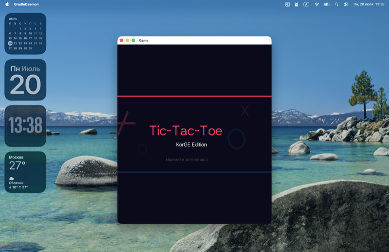

# Tic-Tac-Toe — KorGE Edition

Крестики-нолики на [KorGE](https://korge.org/) — Kotlin Multiplatform Game Engine.

Работает на **Desktop (JVM)** и **Android**.

## Скриншоты

### Splash Screen


### Меню


## Запуск

### Desktop
```bash
JAVA_HOME=/path/to/jdk21 ./gradlew runJvm
```

### Android (эмулятор)
```bash
JAVA_HOME=/path/to/jdk21 ./gradlew runAndroidEmulatorDebug
```

> Требуется JDK 21+ и Android SDK (если нужен Android).

## Возможности

- **Splash-экран** с анимированными X/O и fade-in текстом
- **Меню** с пунктами: Новая игра, Настройки, История, Выход
- **Игровое поле** с кликами, ходами X/O, определением победы и ничьей
- **AI-противник** (алгоритм Minimax)
- **Таймер хода** (5 / 15 / 30 секунд или без ограничений)
- **Размер поля** — 3×3, 4×4, 5×5
- **3 цветовые темы** — Тёмная, Синяя, Зелёная
- **Тёмный / светлый режим**
- **Счёт** — победы X, O и ничьи
- **История** — последние 20 игр с кнопкой очистки
- **Мультиязычность** — Русский, English, Deutsch с мгновенным обновлением интерфейса
- **Сетка** — включение/выключение

## Стек

- Kotlin 2.0.20
- KorGE 6.0.0
- JDK 21
- Gradle 8.9

## Структура проекта

```
├── build.gradle.kts          # Плагин KorGE + Android target
├── settings.gradle.kts       # Репозитории
├── local.properties          # Путь к Android SDK
├── src/commonMain/kotlin/
│   └── Main.kt               # Весь код приложения
└── screenshots/              # Скриншоты
```
