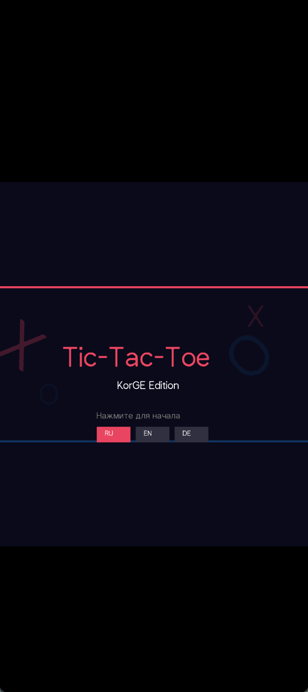
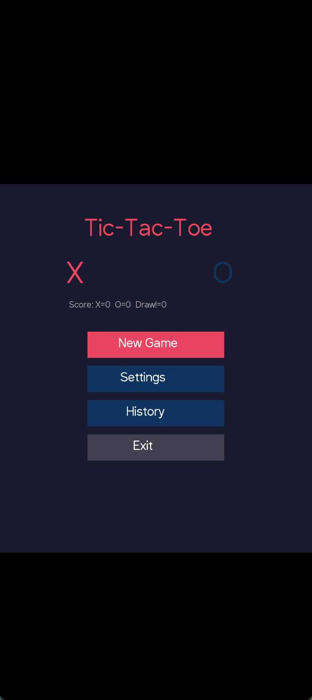
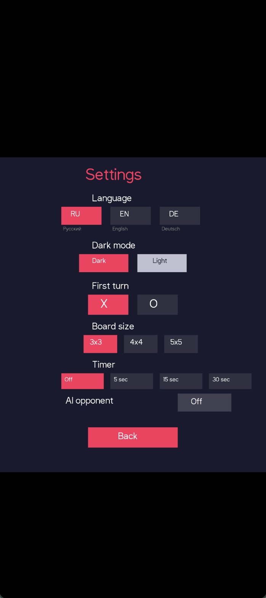
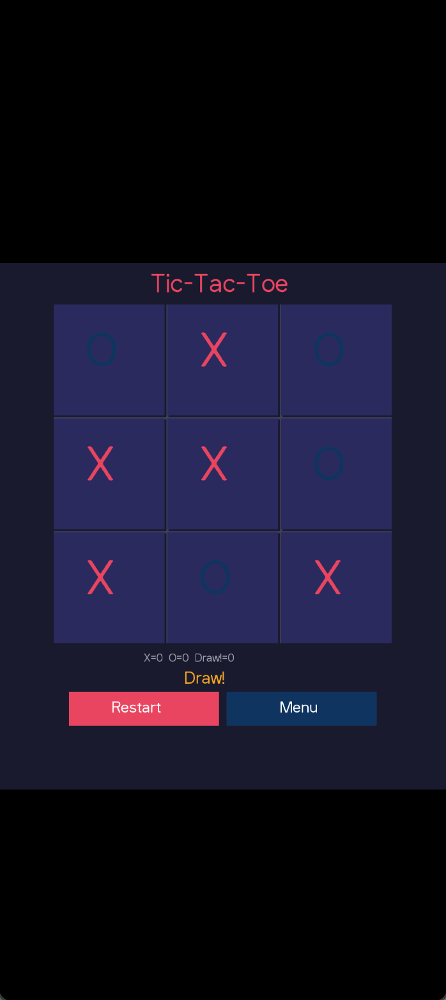
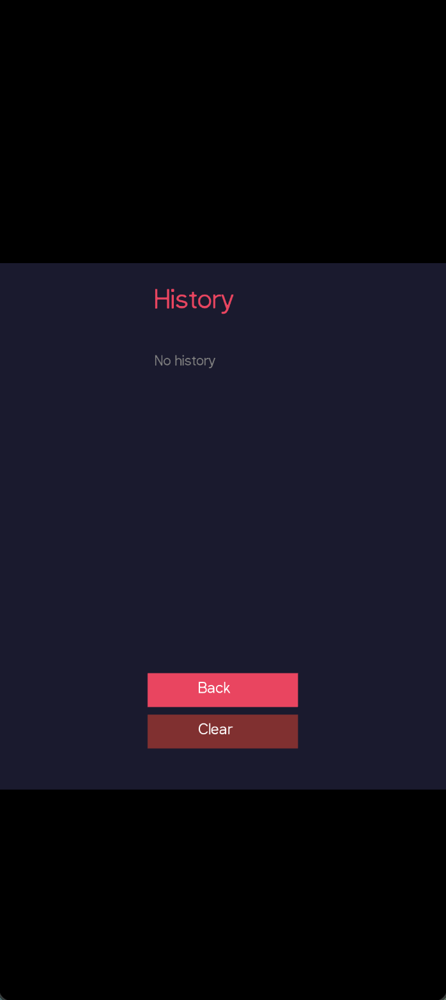

# Tic-Tac-Toe — KorGE Edition

Tic-Tac-Toe built with [KorGE](https://korge.org/) — Kotlin Multiplatform Game Engine.

Runs on **Desktop (JVM)** and **Android**.

## Screenshots

### Desktop

| Splash | Menu | Game | History |
|--------|------|------|---------|
|  |  |  |  |

### Android

| Splash | Menu | Settings | Game | History |
|--------|------|----------|------|---------|
|  |  |  |  |  |

## How to Run

### Desktop
```bash
JAVA_HOME=/path/to/jdk21 ./gradlew runJvm
```

### Android (emulator)
```bash
JAVA_HOME=/path/to/jdk21 ./gradlew runAndroidEmulatorDebug
```

> Requires JDK 21+ and Android SDK (for Android target).

## Features

- **Splash screen** with animated X/O and fade-in text
- **Main menu** with New Game, Settings, History, and Exit
- **Game board** with click-based X/O placement, win and draw detection
- **AI opponent** (Minimax algorithm)
- **Move timer** (5 / 15 / 30 seconds or off)
- **Board size** — 3×3, 4×4, 5×5
- **3 color themes** — Dark, Blue, Green
- **Dark / Light mode** toggle
- **Scoreboard** — X wins, O wins, and draws
- **Game history** — last 20 games with clear button
- **Multi-language** — Russian, English, German with live UI updates
- **Grid lines** — toggle on/off

## Tech Stack

- Kotlin 2.0.20
- KorGE 6.0.0
- JDK 21
- Gradle 8.9

## Internationalization (i18n)

Translations live in Kotlin source code under `src/commonMain/kotlin/i18n/` — **not** in Android `strings.xml` resources.

This is because KorGE renders all text through its own `korlibs.korge.view.Text` view, not through native Android `TextView` or `strings.xml`. The same Kotlin code runs on all platforms (Desktop, Android, Web), so translations must be in shared `commonMain`.

To add a new language:
1. Create `StringsXx.kt` with a new `val stringsXx = Strings(...)` instance
2. Add it to `allStrings` and `allThemeNames` in `Main.kt`

## Project Structure

```
├── build.gradle.kts              # KorGE plugin + Android target
├── settings.gradle.kts           # Repositories
├── local.properties              # Android SDK path
├── src/commonMain/kotlin/
│   ├── Main.kt                   # Application entry point & UI
│   └── i18n/
│       ├── Strings.kt            # Strings data class
│       ├── StringsRu.kt          # Russian translations
│       ├── StringsEn.kt          # English translations
│       └── StringsDe.kt          # German translations
└── screenshots/                  # Screenshots (Desktop + Android)
```

---

# Tic-Tac-Toe — Коротко о проекте

Крестики-нолики на [KorGE](https://korge.org/) — Kotlin Multiplatform Game Engine.

Работает на **Desktop (JVM)** и **Android**.

## Скриншоты

### Desktop

| Splash | Меню | Игра | История |
|--------|------|------|---------|
|  |  |  |  |

### Android

| Splash | Меню | Настройки | Игра | История |
|--------|------|-----------|------|---------|
|  |  |  |  |  |

## Запуск

### Desktop
```bash
JAVA_HOME=/path/to/jdk21 ./gradlew runJvm
```

### Android (эмулятор)
```bash
JAVA_HOME=/path/to/jdk21 ./gradlew runAndroidEmulatorDebug
```

> Требуется JDK 21+ и Android SDK (если нужен Android).

## Возможности

- **Splash-экран** с анимированными X/O и fade-in текстом
- **Меню** с пунктами: Новая игра, Настройки, История, Выход
- **Игровое поле** с кликами, ходами X/O, определением победы и ничьей
- **AI-противник** (алгоритм Minimax)
- **Таймер хода** (5 / 15 / 30 секунд или без ограничений)
- **Размер поля** — 3×3, 4×4, 5×5
- **3 цветовые темы** — Тёмная, Синяя, Зелёная
- **Тёмный / светлый режим**
- **Счёт** — победы X, O и ничьи
- **История** — последние 20 игр с кнопкой очистки
- **Мультиязычность** — Русский, English, Deutsch с мгновенным обновлением интерфейса
- **Сетка** — включение/выключение

## Стек

- Kotlin 2.0.20
- KorGE 6.0.0
- JDK 21
- Gradle 8.9

## Интернационализация (i18n)

Переводы хранятся в Kotlin-коде в `src/commonMain/kotlin/i18n/` — **не** в Android-ресурсах `strings.xml`.

Это связано с тем, что KorGE рисует весь текст через свой view `korlibs.korge.view.Text`, а не через нативный Android `TextView` или `strings.xml`. Один и тот же Kotlin-код работает на всех платформах (Desktop, Android, Web), поэтому переводы должны быть в общем `commonMain`.

Чтобы добавить новый язык:
1. Создать `StringsXx.kt` с новым экземпляром `val stringsXx = Strings(...)`
2. Добавить его в `allStrings` и `allThemeNames` в `Main.kt`

## Структура проекта

```
├── build.gradle.kts              # Плагин KorGE + Android target
├── settings.gradle.kts           # Репозитории
├── local.properties              # Путь к Android SDK
├── src/commonMain/kotlin/
│   ├── Main.kt                   # Точка входа и UI
│   └── i18n/
│       ├── Strings.kt            # Data class со строками
│       ├── StringsRu.kt          # Русские переводы
│       ├── StringsEn.kt          # Английские переводы
│       └── StringsDe.kt          # Немецкие переводы
└── screenshots/                  # Скриншоты (Desktop + Android)
```
